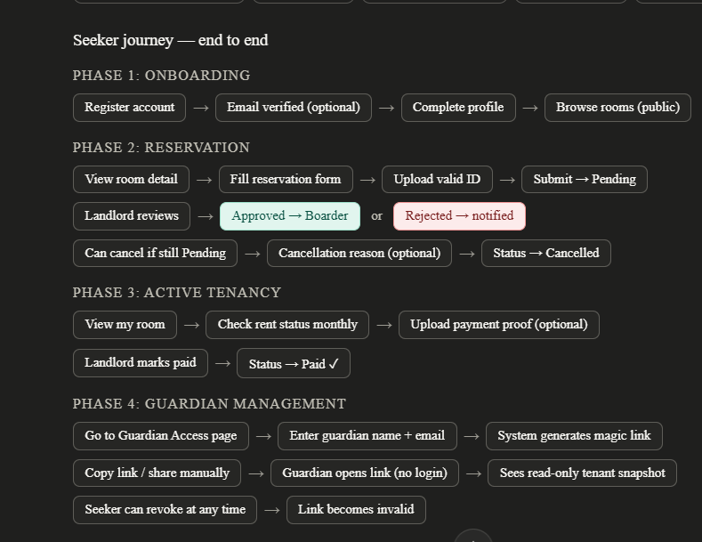

# User Flow

This document is a planning reference for the seeker and guardian journeys. It is not an implementation record.

## Visual Reference

## Seeker Journey - End To End

### Phase 1: Onboarding

Register account

→

Email verified optional

→

Complete profile

→

Browse rooms public

### Phase 2: Reservation

View room detail

→

Fill reservation form

→

Upload valid ID

→

Submit

→

Status: Pending

Landlord reviews

→

Approved

→

Boarder

or

Rejected

→

Notified

Can cancel if still Pending

→

Cancellation reason optional

→

Status: Cancelled

### Phase 3: Active Tenancy

View my room

→

Check rent status monthly

→

Upload payment proof optional

Landlord marks paid

→

Status: Paid

### Phase 4: Guardian Management

Go to Guardian Access page

→

Enter guardian name and email

→

System generates magic link

Copy link or share manually

→

Guardian opens link without login

→

Sees read-only tenant snapshot

Seeker can revoke at any time

→

Link becomes invalid

## Guardian Journey - End To End

Receives link from seeker

→

Opens `/guardian-view/:token`

→

Token validated by backend

Valid

→

Sees tenant snapshot

or

Invalid or revoked

→

Error page

Guardian view includes:

- Room info, read-only
- Rent status, read-only
- Landlord contact, visible

Can bookmark link

→

Returns anytime while link is valid

→

Last-accessed timestamp is logged

## Implementation Note

Do not implement this yet. Use this flow as a guide when the seeker and guardian access work is scheduled.
